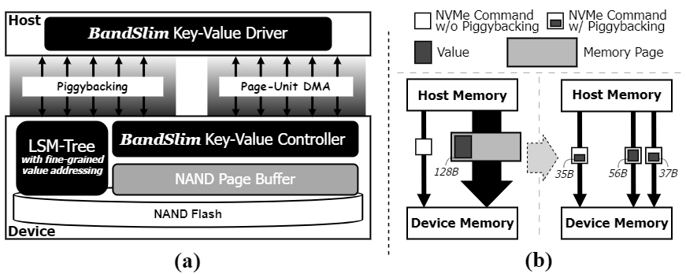
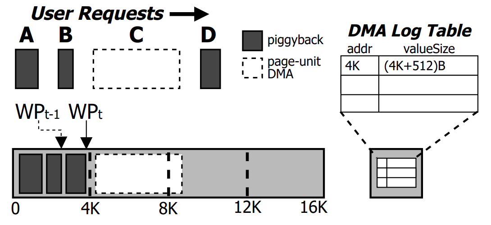

# _BandSlim_: A Novel Bandwidth and Space-Efficient KV-SSD with an Escape-from-Block Approach
<!--[](https://zenodo.org/doi/10.5281/zenodo.10672947) [](https://archive.softwareheritage.org/browse/origin/?origin_url=https://github.com/lass-lab/DeepVM) [](https://archive.softwareheritage.org/swh:1:dir:561f421fa40bdc4fdb1f9f0c63b8f93e73886717;origin=https://github.com/lass-lab/DeepVM;visit=swh:1:snp:1c3553a75d1f6d2d8a3dc6392c0f418747bf3fa5;anchor=swh:1:rev:b7c1bce36ec625dd8847ce111d36bc456718d980)-->
## Introduction

<p align="center">
  
</p>

This repository hosts the open-source implementation of _BandSlim_, a solution introduced in a paper submitted to ICPP 2024. _BandSlim_ is a novel framework designed to enhance data transfer efficiency and storage space utilization in KV-SSDs. </br>
- **Figure (a)**: software architecture overview of _BandSlim_. </br>
- **Figure (b)**: NVMe-command-piggybacking-based value transfer proposed in _BandSlim_. </br>

## What is _BandSlim_?

_BandSlim_ is a purely software-based solution that can be integrated into any KV-SSD with only minor modifications to software elements like device drivers and firmware. _BandSlim_ is equipped with two methods to streamline bandwidth during I/O transmission: **(i)** _Fine-grained Inline Value Transfer_, **(ii)** _Fine-grained Value Packing with Selective Packing_

**1. Fine-grained Inline Value Transfer**: it employs an inline value transfer mechanism that incorporates values smaller than a memory page size directly into the reserved fields of NVMe commands, substantially reducing the volume of data transmitted over the interconnect to convey the desired value. </br>
  - it incorporates an **adaptive value transfer strategy** that melds NVMe-command-piggybacking with rapid, page-unit Direct Memory Access (DMA), optimizing the response times for transferring values of varying, especially large sizes. </br>
    - ```c
      /* Adaptive Value Transfer Algorithm */
      if (value_size <= threshold1 * alpha) {
          // Mode 1. Piggybacking-based Value Transfer
          Piggyback(value_addr, value_size);
      } else if (value_size % 4096 <= threshold2 * beta) {
          // Mode 2. Hybrid Value Transfer
          page_size = (value_size / 4096) * 4096;
          PRPbasedDMA(value_addr, page_size);
          Piggyback(value_addr + page_size, value_size - page_size);
      } else {
          // Mode 3. PRP-based Value Transfer
          extra_page = (value_size % 4096) > 0 ? 1 : 0;
          page_size = ((value_size / 4096) + extra_page) * 4096;
          PRPbasedDMA(value_addr, page_size);
      }
      ```

**2. Fine-grained, Efficient Value Packing**: it adopts a _Selective Packing with Backfilling Policy_ specifically designed for meticulous management of the NAND page buffer. 
  - it addresses a common issue in in-device DMA engines, which require the DMA destination address to be aligned with a memory page block (4KB), necessitating memory copies for fine-grained packing of DMA-transferred values.

<p align="center">
  
</p>

  - it maintains alignment rules for large values transferred via page-unit DMA, but it strategically fills the gaps with smaller values transferred via piggybacking (see the above figure). Thus, it can reduce the overhead associated with memory copies when packing large values while maximizing NAND page utilization.

## Components

### _BandSlim_ Key-Value Driver

This component piggybacks values onto NVMe commands, achieving PCIe data traffic generated close to the requested value size. It also optimizes the transfer times of relatively large values by using an adaptive approach.

### _BandSlim_ Key-Value Controller

This component packs received values into the NAND page buffer entry in a fine-grained manner. It features the _Selective Packing with Backfilling Policy_ to address the memory copy overheads that occur when packing relatively large values transferred via PRP-based page-unit DMA in the adaptive value transfer.

### LSM-tree with Fine-Grained Value Addressing

A key-value separated LSM-tree storage engine featuring fine-grained value addressing over the vLog.

<!--
## Dataset

### Virtual Instance Data

The virtual instance data is in the following `json` format.

```json
{
    "instances": [
        {
            "name": "A",
            "ondemand_price": 0.75,
            "spot_price": 0.225,
            "network_bandwidth": 10.0,
            "flops": 100.0,
            "a": 0.14,
            "b": 14.5,
            "c": 13.5,
            "type": "G",
            "vCPU": 4
        },
    ],
    "available_vcpus": {
        "G": {
            "ondemand": 32,
            "spot": 128
        },
    }
}
```

`instances` include information about each instance, encompassing name, price, hardware specifications, and performance.
`available_vcpus` records the maximum number of each type of instance that can be used.

### Real Instance Data

The real instance data is divided into parts embedded in the code and those stored in `json`.
The part embedded in the code includes the parameters of the regression function and the $n_{sat}$ values based on network bandwidth.

```python3
a_values = {
    ...
}
b_values = {
    ...
}
c_values= {
    ...
}
table = {
    ...
}
```

The part stored in `json` format is similar to the virtual instance data.

```json
{
    "instances": [
        {
            "name": "g3s.xlarge",
            "type": "G",
            "ondemand_price": 0.75,
            "spot_price": 0.225,
            "vCPU": 4,
            "memory": 30.5,
            "network_bandwidth": 10,
            "flops": 100
        },
    ],
    "available_vcpus": {
        "G": {
            "ondemand": 32,
            "spot": 128
        },
    }
}
```

## Requirements

Download the necessary Python packages using the following command:

```bash
pip install -r requirements.txt
```

Additionally, you may need to download the necessary Linux packages for graph generation using the following command:

```bash
sudo apt update
sudo apt install texlive texlive-latex-extra texlive-fonts-recommended dvipng cm-super
```-->

## Important Note

<!-- - The provided software and algorithms are for research and educational purposes. Users should exercise caution and understand the limitations and requirements of each component.-->

- **The source code for the _BandSlim_ key-value controller is currently undergoing preparations for public release at the time of submission.**
  - We anticipate uploading the entire source code around ~~mid-May~~ extended to **early-June**.

## Repository Structure

The artifact currently consists of one main directory:

- `db_bench/`: a modified version of RocksDB's popular benchmarking tool, _db\_bench_.
  - `tools/`: it includes _BandSlim_'s user-facing key-value API and NVMe driver functions.
    - `iLSM.cc, iLSM.h`: a core part of _BandSlim_ key-value API and driver.
    - `db_bench_tool.c`: it implements various workloads including _mix\_graph (M)_, _fill\_seq (A)_, and some synthetic patterns like _B, C, D_ presented in the paper.
  - `test.sh`: a simple test script that we can specify and run workloads.
- `firmware/`: it containts the source code for the firmware of _BandSlim_'s LSM KV-SSD.
  - `src/`: it houses all the firmware source code necessary for the LSM KV-SSD's operation.
    - `nvme/`: it contains the source code for the NVMe controller (under preparation).
    - `sstable/`: the implementations related to the in-device LSM-tree, specifically focusing on the SSTable components.
    - `memtable/`: it focuses on the MemTable components of the in-device LSM-tree.
